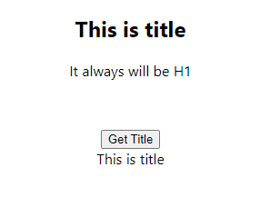

# Learning Slate

Project in which I am learning how to configure slate.

<!--more-->

## Changing content
- Changing content of the slate from outside of Slate, used when you want to update content in the reaction to state change

## ForcedLayout 
- Forced title in the slate

